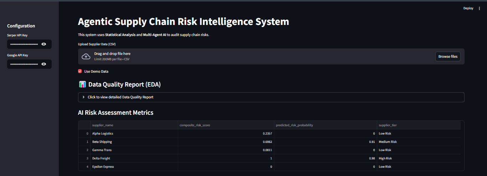
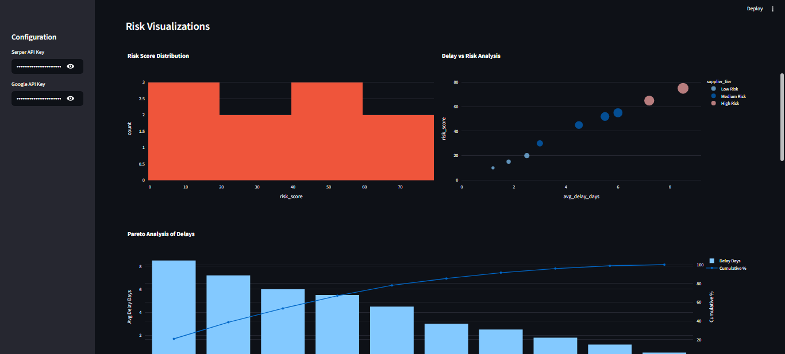
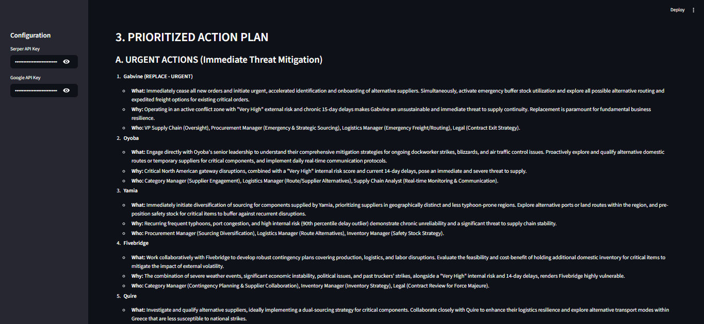

# Agentic Supply Chain Risk Intelligence System

A data-driven, multi-agent AI system for analyzing supply chain risks using statistical modeling and LLM-based investigation.







## Features

- **Statistical Risk Scoring**: Automatically flags risky suppliers using Z-Scores, Percentiles (90th), and Composite Risk Scores.
- **Multi-Agent AI**:
  - **Auditor Agent**: Analyzes internal data for anomalies.
  - **Investigator Agent**: Searches the web for external disruptions (strikes, weather, politics).
  - **Manager Agent**: Generates strategic action plans (Retain/Monitor/Replace).
- **Interactive Dashboard**: Built with Streamlit and Plotly for deep data exploration.
- **Predictive Modeling**: Uses Random Forest to estimate the probability of future disruptions.
- **Automated EDA**: Instant data quality reports and statistical summaries.

## Installation

1. **Clone the repository**:
   ```bash
   git clone <your-repository-url>
   cd agentic-supply-chain
   ```

2. **Install dependencies**:
   ```bash
   pip install -r requirements.txt
   ```
   *Note: Ensure you have `plotly`, `crewai`, and `scikit-learn` installed. If you encounter issues with `streamlit` not being found, follow the usage steps below.*

3. **Set up API Keys**:
   This app requires a **Google Gemini API Key** (for the LLM) and a **Serper API Key** (for Google Search). You can enter them in the app sidebar.

## Usage

1. **Run the Application**:
   Since `streamlit` might not be in your global PATH, use the module invocation:
   ```bash
   python -m streamlit run src/app.py
   ```
   
   Alternatively, you can run the provided batch script if available:
   ```bash
   src/run_app.bat
   ```

2. **Analyze Data**:
   - **Upload CSV**: Upload your own supplier data.
   - **Use Demo Data**: Toggle the checkbox to load built-in synthetic data for testing.

3. **Kickoff Agents**:
   - Scroll down to the "Agentic Investigation" section.
   - Click **Kickoff Agents**.
   - The system will sequentially audit suppliers, check external news, and generate a final report.

## Project Structure

```
├── src/
│   ├── app.py               # Modular entry point (Run this)
│   ├── agents/              # CrewAI Agent definitions
│   ├── analysis/            # Risk scoring & Feature engineering logic
│   ├── models/              # Predictive models
│   ├── visualization/       # Plotly chart generation
│   └── full_app.py          # Legacy monolithic version
├── data/
│   └── sample_suppliers.csv # Sample dataset
├── requirements.txt         # Python dependencies
└── README.md                # This file
```

## Testing

Run the test suite to verify the logic:
```bash
python -m pytest
```

## License

MIT License

